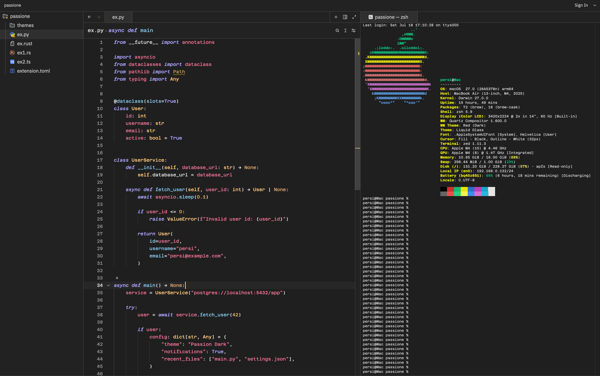
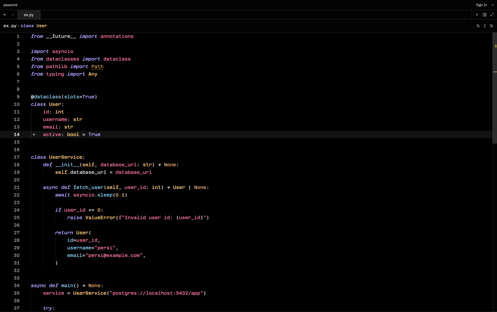
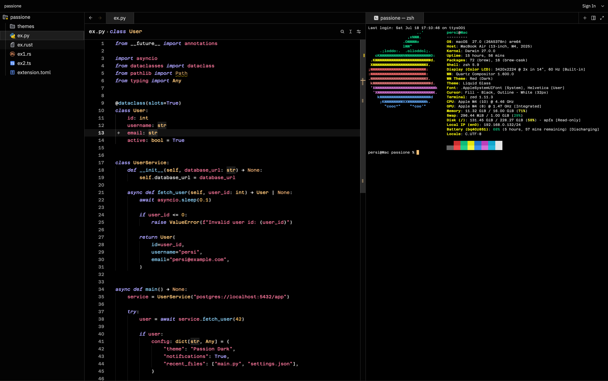

# Passion

  Dark themes for Zed, VS Code, and JetBrains with bright green strings, neutral surfaces, and a soft pink accent.

  
  
  
  

  <a href="#download">Download</a> •
  <a href="#preview">Preview</a> •
  <a href="#install">Install</a> •
  <a href="#variants">Variants</a>

---

## Download

Pick your editor and download only the package it needs.

<table width="100%" bgcolor="#1f1f1f" cellpadding="18" cellspacing="0" style="border:1px solid #80808059; border-radius:8px;">
  <tr>
    <td width="33%" valign="top" align="center">
      

        

           Zed
        

        
Native Zed extension.

        
<a href="./dist/passione-zed-1.2.0.zip"><strong>Download</strong></a>

        
<a href="./zed/README.md">Install guide</a>

      

    </td>
    <td width="33%" valign="top" align="center">
      

        

           VS Code
        

        
VS Code theme extension.

        
<a href="./dist/passione-vscode-1.2.0.vsix"><strong>Download</strong></a>

        
<a href="./vscode/README.md">Install guide</a>

      

    </td>
    <td width="33%" valign="top" align="center">
      

        

           JetBrains
        

        
JetBrains theme plugin.

        
<a href="./dist/passione-jetbrains-1.2.0.zip"><strong>Download</strong></a>

        
<a href="./jetbrains/README.md">Install guide</a>

      

    </td>
  </tr>
</table>

---

## Preview

<strong>Editor</strong>

<strong>Terminal</strong>

<strong>Editor</strong>

<strong>Terminal</strong>

---

## Install

Each editor has its own package and install flow.

| Editor | Package | Install |
| --- | --- | --- |
|  Zed | `passione-zed-1.2.0.zip` | Extract the zip, open Zed, run `zed: install dev extension`, then select the extracted folder. |
|  VS Code | `passione-vscode-1.2.0.vsix` | Open VS Code, run `Extensions: Install from VSIX...`, and choose the `.vsix`. |
|  JetBrains | `passione-jetbrains-1.2.0.zip` | Open your JetBrains IDE, go to `Settings` -> `Plugins` -> gear menu -> `Install Plugin from Disk...`, then pick the zip. |

---

## Variants

<table>
  <tr>
    <td width="50%" valign="top">
      <h3>Passione Dark</h3>
      <ul>
        <li>Balanced dark surfaces</li>
        <li>Bright green strings</li>
        <li>Soft pink accents</li>
      </ul>
    </td>
    <td width="50%" valign="top">
      <h3>Passione OLED</h3>
      <ul>
        <li>True-black backgrounds</li>
        <li>High-contrast UI edges</li>
        <li>Same shared palette</li>
      </ul>
    </td>
  </tr>
</table>

---

## License

Released under the [MIT License](./LICENSE).
