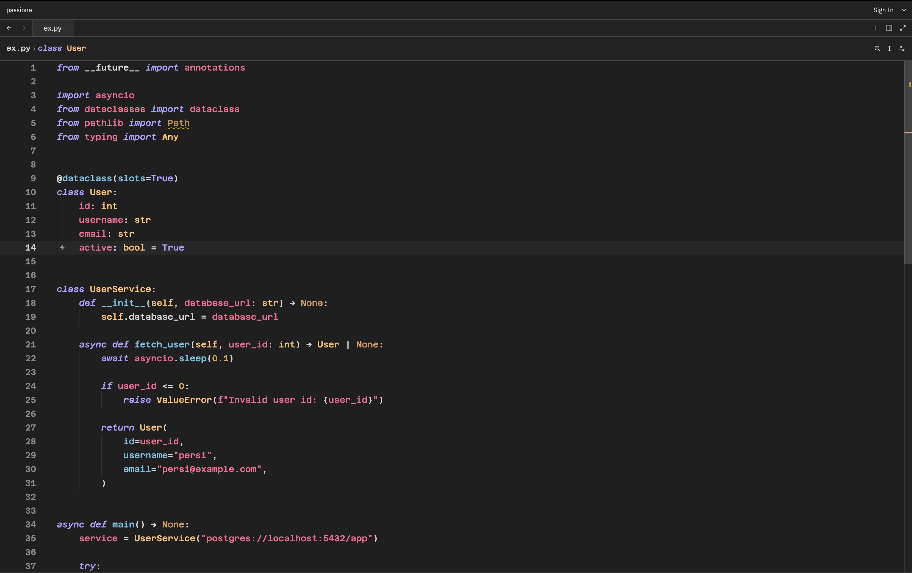

# Passion for JetBrains

Passion ships as a JetBrains theme plugin with two variants:

- `Passione Dark`
- `Passione OLED`

## Download

Download the JetBrains package from the repo:

[Download passione-jetbrains-1.2.0.zip](../dist/passione-jetbrains-1.2.0.zip)

## Install

1. Download `passione-jetbrains-1.2.0.zip`.
2. Open your JetBrains IDE.
3. Go to `Settings` -> `Plugins`.
4. Open the gear menu.
5. Choose `Install Plugin from Disk...`.
6. Select the downloaded `.zip` file.
7. Restart the IDE when prompted.
8. Go to `Settings` -> `Appearance & Behavior` -> `Appearance`.
9. Choose `Passione Dark` or `Passione OLED`.

## Preview

  

